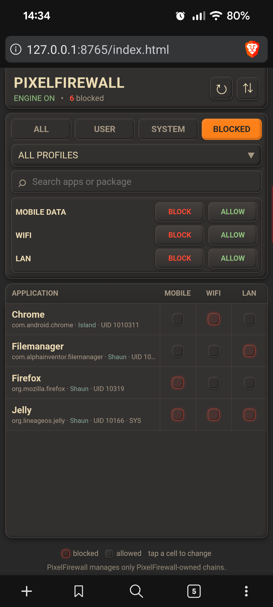

## Preview

# PixelFirewall

PixelFirewall is a rooted Android firewall module for controlling
network access on a per-application basis.

It provides a lightweight WebUI for managing application network
policies across **mobile data, Wi-Fi, and LAN**, with support for
multiple Android user profiles and both IPv4 and IPv6.

## Features

- Per-application network access control
- Block or allow access independently for:
  - Mobile data
  - Wi-Fi
  - LAN
- IPv4 and IPv6 support
- Multiple Android user profiles
- VPN aware network handling
- Application filtering and search
- Live policy status
- Policy backup and restore
- JSON policy export/import
- Clear all PixelFirewall policies from the WebUI
- Lightweight local WebUI
- Designed for Magisk
- No dependency on KernelSU

## Requirements

- Rooted Android device
- Magisk
- Android device with working `iptables`/`ip6tables` firewall support
- A modern web browser for the WebUI

PixelFirewall is developed and tested on a rooted Google Pixel 8a.

## Installation

Install PixelFirewall as a Magisk module using the standard Magisk
module installation process.

After installation, reboot the device if required by Magisk.

PixelFirewall provides a local WebUI for managing policies.

The module's WebUI is available at:

`http://127.0.0.1:8765/index.html`

The module's Action button can also be used to open the WebUI.

## Using PixelFirewall

### Application policies

The main interface presents installed applications in a
network-policy matrix.

Each application has independent controls for:

| Network | Description |
|---|---|
| Mobile | Mobile/cellular data |
| Wi-Fi | Wi-Fi network traffic |
| LAN | Local network traffic |

Tap a network cell to change that application's policy.

Blocked and allowed states are shown directly in the application
list, making it possible to see the current policy without opening a
separate configuration screen.

### Profiles

PixelFirewall supports Android's multiple-user environment.

Applications are associated with their Android user/profile,
allowing policies to be managed independently for applications
belonging to different profiles.

The WebUI provides profile selection and application filtering to
make it easier to manage applications on devices using multiple
Android users or work/profile environments.

### Application filtering

The application list can be filtered to make larger application
lists easier to manage.

Available filtering includes:

- All applications
- User applications
- System applications
- Blocked applications

Applications can also be searched directly from the WebUI.

## VPN handling

PixelFirewall tracks the underlying network used by VPN
connections so that network policies continue to follow the
appropriate physical network.

This allows policies for Wi-Fi, mobile data, and LAN traffic to
remain effective when applications are using a VPN connection.

## Policy backup and restore

PixelFirewall can export its current policy to a JSON backup file.

Backups contain PixelFirewall policy entries only.

Each exported policy entry contains the policy information and,
when the matching application is available, application metadata:

- Application UID
- Network type
- Block action
- Application name
- Package name
- Android user/profile ID
- Profile name
- System/user app classification

The UID, network type, and action are used to identify and restore
the corresponding PixelFirewall policy. The application metadata is
included to make the backup easier to read and audit.

A backup can later be imported to restore the corresponding
PixelFirewall policies.

Importing a backup replaces the current PixelFirewall policy state
with the policies contained in the backup.

The WebUI also provides an option to clear all PixelFirewall blocks.

## How PixelFirewall works

PixelFirewall maintains its own firewall policy chains and uses
them to apply application-specific network policies.

The primary PixelFirewall chains are:

- `PIXELFW`
- `PIXELFW-MOBILE`
- `PIXELFW-WIFI`
- `PIXELFW-LAN`

IPv6 uses the corresponding PixelFirewall-owned chains as well.

The main `PIXELFW` dispatcher determines the appropriate
PixelFirewall network policy chain based on the active network.

Application policies are then applied using the application's
Android UID.

This keeps PixelFirewall's policy state separate from unrelated
Android native firewall configuration.

## Firewall scope and safety

PixelFirewall is designed to operate only on firewall chains owned
by PixelFirewall.

**PixelFirewall does not flush, delete, or modify unrelated/native
Android firewall chains or rules.**

The WebUI manages PixelFirewall policy state rather than directly
manipulating the device's native firewall configuration.

Policy backup, import, and clear operations likewise operate only
on PixelFirewall policy entries.

This separation is an important part of PixelFirewall's design.

## WebUI

The WebUI uses a dark Gruvbox inspired interface with raised,
embossed card styling and clear visual separation between application
controls and larger policy-management elements.

The interface is designed around the application policy matrix rather
than a collection of complex configuration pages.

The main interface provides:

- Application list
- Network policy controls
- Profile selection
- Application filtering
- Search by application name or package
- Policy status and blocked-rule count
- Backup and restore controls
- Clear-policy controls

## Troubleshooting

### The WebUI does not load

Check that the PixelFirewall module is enabled in Magisk and that
the PixelFirewall WebUI server is running.

The WebUI is served locally on:

`127.0.0.1:8765`

Try opening:

`http://127.0.0.1:8765/`

If the root address does not open, try:

`http://127.0.0.1:8765/index.html`

### An application does not appear

Refresh the WebUI and check the selected Android profile and
application filter.

Applications belonging to another Android user/profile may not
appear when a different profile is selected.

### A policy does not appear immediately

PixelFirewall refreshes policy state through the WebUI API.

The WebUI also polls for policy changes while it is visible.
Refreshing the page forces the interface to reload the current policy
state.

### Network behaviour changes after switching networks

PixelFirewall maintains a network dispatcher so that policies can
follow changes between Wi-Fi, mobile data, LAN, and VPN underlying
networks.

If a network transition appears to leave an application in the
wrong state, first refresh the WebUI and verify the current policy.

## Development

PixelFirewall is developed as a Magisk module with its firewall
engine, network dispatcher, policy storage, application metadata
helper, and WebUI maintained as separate components.

The WebUI is served locally by the module and communicates with
PixelFirewall through CGI endpoints.

The project is developed and tested on-device using a rooted Pixel
8a and Linux development environment.

## Project principles

PixelFirewall follows a few core principles:

1. **Application-level control**

   Policies are associated with Android application UIDs rather than
   broad system-wide rules.

2. **Network-specific policies**

   Mobile, Wi-Fi, and LAN access can be controlled independently.

3. **IPv4 and IPv6 parity**

   Policies are applied consistently across both IP versions.

4. **Profile awareness**

   Android user/profile separation is preserved.

5. **Minimal firewall scope**

   PixelFirewall operates only on its own firewall chains.

6. **Simple management**

   The WebUI provides a straightforward way to inspect and change
   policies without requiring command-line interaction.

## Donations

If you find PixelFirewall useful and would like to support its
development, donations are appreciated but entirely optional.

### PEP

`PvYk6mcQ2HBGNXGkEi7TDKHNAK1skNzj7K`

### Bitcoin (BTC)

`bc1qf2ccj00zgfk0y5s6xmykvq89qq5a4e5ulweyun`

### Stellar (XLM)

`GDPCFLZE3UPXXQLZITWZZA67MRY35S4T223HLEOQGAKG7IKLX5F5ZM4I`

Thank you for supporting the project.

## License

See the repository license for the terms under which PixelFirewall
is distributed.
